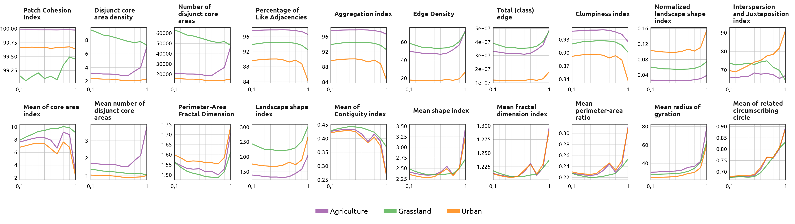
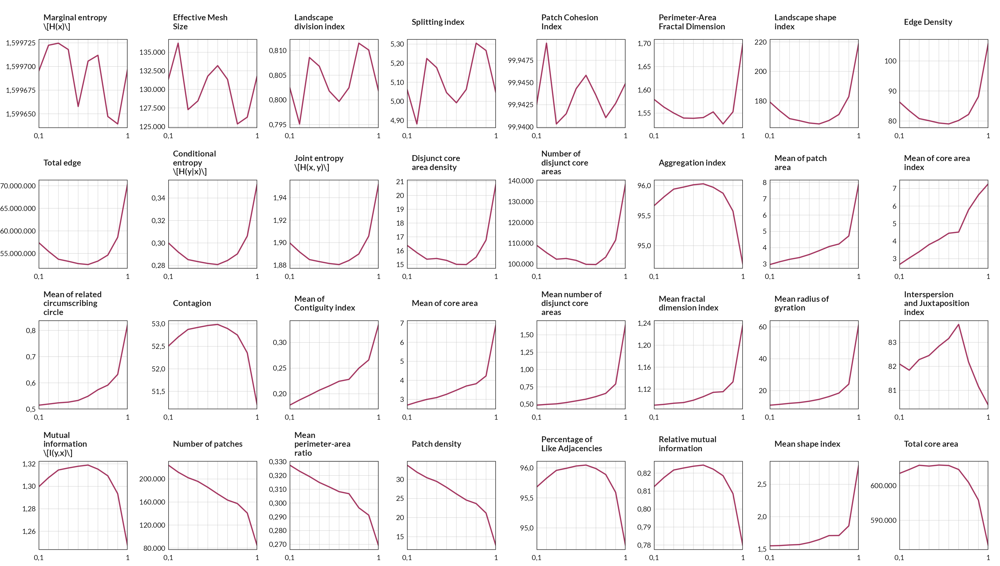

El paquete usado es [`{rflsgen}`](https://dimitri-justeau.github.io/rflsgen/), **Neutral Landscape Generator with Targets on Landscape Indices**.

::: {.callout-caution}

Antes que nada hay que ejecutar los siguientes comandos:

```{r}
#| code-fold: false
#| warning: false
#| eval: false

options(
  java.parameters = c("-XX:+UseConcMarkSweepGC", "-Xmx36g")
)
gc()
```

Esto permite aumentar la memoria disponible para las funciones de `{rflsgen}`.

:::

Los paquetes usados son los siguientes:

```{r}
#| warning: false
#| message: false
#| code-fold: false

library(tidyverse)
library(gt)
library(landscapemetrics)
library(NLMR)
library(rflsgen)
library(terra)
```


## Lectura de datos

Inicialmente hay que leer los ráster de uso de suelo (`r`) y modelo digital de elevación (`dem`).

```{r}
r <- rast("datos/r.tif")
dem <- rast("datos/dem.tif")
```

Las clases de `r` son:

```{r}
#| echo: false

read_delim(
  file = "datos/LULCcode.txt",
  delim = "$ ",
  col_names = c("value"),
  show_col_types = FALSE
) |>
  separate_wider_delim(
    delim = " ",
    cols = value,
    names = c("value", "tipo"),
    too_many = "merge"
  ) |>
  mutate(value = as.integer(value)) |>
  rename(Valor = value, Tipo = tipo) |>
  gt::gt() |>
  tab_style(
    locations = cells_body(columns = Valor),
    style = cell_text(font = "JetBrains Mono", color = "black")
  )
```

Agrego las categorías a `r` e incorporo colores. Visualizo ambos ráster.


```{r}
d <- read_delim(
  file = "datos/LULCcode.txt",
  delim = "$ ",
  col_names = c("value"),
  show_col_types = FALSE
) |>
  separate_wider_delim(
    delim = " ",
    cols = value,
    names = c("value", "tipo"),
    too_many = "merge"
  ) |>
  mutate(value = as.integer(value)) |>
  filter(value != 0) |>
  mutate(col = c(
    "#E41A1C", "#377EB8", "#4DAF4A", "#984EA3", "#FF7F00", "#A65628", "#F781BF"
  ))

col_df <- d |>
  select(-tipo) |>
  as.data.frame()

# incorporo categorías y colores
levels(r) <- d
coltab(r) <- col_df
```

::: {.column-screen-inset}

```{r}
#| echo: false
#| layout-ncol: 2

plot(
  r, axes = FALSE, mar = c(1, 1, 1, 8), main = "LULC"
)

plot(
  dem, axes = FALSE, mar = c(1, 1, 1, 8), main = "DEM"
)
```

:::

## Extracción de la estructura del paisaje

Se seleccionan las clases de interés del ráster de cobertura del suelo.

```{r}
#| eval: false

clases <- c(30, 40, 50) # Grassland, Agriculture, Urban

estructura <- flsgen_extract_structure_from_raster(
  raster_file = r,
  focal_classes = clases,
  connectivity = 8
)
```

A partir de `estructura` y `dem` se genera un paisaje, indicando dependencia del terreno, conectividad, rugosidad y parámetros de posición.

Para visualizar el efecto de la dependencia del terreno (`terrain_dependency`) se generan 10 escenarios con valores crecientes entre 0,1 y 1,0.

```{r}
#| eval: false

f_dependencia <- function(x) {
  print(paste0("Dependencia del terreno: ", x))

  r_land <- flsgen_generate(
    estructura,
    terrain_file = dem,
    terrain_dependency = x,
    connectivity = 8,
    epsg = "EPSG:22174",
    resolution_x = res(r)[1],
    resolution_y = res(r)[2],
    x = ext(dem)$"xmin",
    y = ext(dem)$"ymax"
  )

  writeRaster(r_land, filename = paste0("rasters/land-", x, ".tif"))
}

dependencias <- seq(.1, 1, .1)
walk(dependencias, f_dependencia)
```

Se muestran a continuación los escenarios para las dependencias del terreno 0,1, 0,3, 0,7 y 1,0.

::: {.column-screen-inset}

```{r}
#| echo: false
#| layout-ncol: 2
#| layout-nrow: 2

dependencias <- c(.1, .3, .7, 1)
clases <- c(30, 40, 50) # Grassland, Agriculture, Urban

d_r <- d |>
  filter(value %in% clases) |>
  mutate(value = as.integer(seq(0, length(clases) - 1, 1))) |>
  add_row(
    value = as.integer(-1),
    tipo = "X",
    col = "grey70"
  )

col_r_df <- d_r |>
  select(-tipo) |>
  as.data.frame()

f_estilo <- function(x) {
  levels(x) <- d_r
  coltab(x) <- col_r_df
  return(x)
}

land_list <- list.files(path = "rasters/", pattern = "land-", full.names = TRUE)
land_raster <- map(land_list, rast)
land_raster <- map(land_raster, f_estilo)

walk(
  1:4,
  ~plot(
    land_raster[[.x]], axes = FALSE, mar = c(1, 1, 1, 8),
    main = paste0("Dependencia del terreno: ", dependencias[.x])
  )
)

```

:::

El paquete `{rflsgen}` genera múltiples escenarios pero manteniendo constantes las métricas del paisaje.

En la generación de los escenarios pueden suceder dos errores:

- **Falta de memoria**, al no contar con la suficiente capacidad de procesamiento. Para solucionarlo se puede reducir el tamaño de la región de interés, aumentar el tamaño de píxel o disminuir el número de clases.

- **Incapacidad de generar el ráster**, mostrando el siguiente mensaje:

```r
Could not generate a raster satisfying the input landscape structure
```

Esto puede solucionarse eligiendo únicamente las clases de interés.

## Cálculo de métricas del paisaje

Para el cálculo de las métricas se utiliza el paquete [`{landscapemetrics}`](https://r-spatialecology.github.io/landscapemetrics/).

Las métricas se dividen en parche, clase y paisaje. A continuación se muestran los resultados para los escenarios considerando todas las dependencias del terreno.

### Cálculo de métricas a nivel de <span style='text-decoration: underline;'>clase</span>

Las métricas del paisaje a nivel de clase devuelven un valor asociado a cada categoría del ráster de interés.

```{r}
#| echo: false

funcion_generica_clase <- function(raster, funcion) {
  i <- which(funciones_clase == funcion)
  print(paste0(i, "/", length(funciones_clase)))
  print(funcion)
  ff <- eval(str2lang(funcion))
  ff(raster)
}

funciones_clase <- ls("package:landscapemetrics")[
  str_detect(ls("package:landscapemetrics"), "lsm_c")
]
funciones_clase <- funciones_clase[!str_detect(funciones_clase, "_cv|_sd")]

# elimino: 'lsm_c_enn_mn'
funciones_clase <- funciones_clase[funciones_clase != "lsm_c_enn_mn"]

# 32 funciones

f_loop_clase <- function(z, dep) {
  map2(
    .x = land_raster[[z]],
    .y = funciones_clase,
    ~funcion_generica_clase(raster = .x, funcion = .y),
    .progress = TRUE
  ) |>
    list_rbind() |>
    mutate(dependencia_terreno = dep) |>
    write_csv(paste0("datos/metricas_clase_", dep, ".csv"))
  beepr::beep(2)
}

# {
#   t1 <- Sys.time()
#   f_loop_clase(10, 1)
#   t2 <- Sys.time()
#   t2-t1 # 34m, 43m, 35m, 35m, 41m, 37m, 38m, 32m, 36m, 36m
# }

# 6h 7m
```

Se calcularon en total `{r} length(funciones_clase)` métricas de clase. Las métricas que son independientes de las dependencias del terreno se muestran en la siguiente tabla.

```{r}
#| echo: false

metricas_csv <- list.files(
  path = "datos/",
  pattern = "_clase_",
  full.names = TRUE
)

m_clase <- read_csv(metricas_csv, show_col_types = FALSE) |> 
  rename(clase = class) |> 
  inner_join(
    rename(d_r, clase = value),
    by = join_by(clase)
  ) |> 
  filter(clase != -1) |> 
  select(metric, valor = value, dependencia_terreno, tipo)

metric_orden <- m_clase |> 
  mutate(
    v = scales::rescale(valor),
    .by = metric
  ) |> 
  select(-valor) |> 
  pivot_wider(
    names_from = tipo,
    values_from = v,
    id_cols = c(dependencia_terreno, metric)
  ) |> 
  unnest(-metric) |> 
  mutate(
    s = Grassland + Agriculture + Urban
  ) |> 
  nest(.by = metric) |> 
  mutate(
    dep_min = map(data, ~slice_min(.x, order_by = dependencia_terreno)$s),
    dep_max = map(data, ~slice_max(.x, order_by = dependencia_terreno)$s)
  ) |> 
  unnest(cols = starts_with("dep_")) |> 
  mutate(
    p = abs(dep_min - dep_max)/((dep_min + dep_max)/2)
  ) |> 
  select(metric, data, p) |> 
  unnest(data) |> 
  mutate(metric = fct_reorder(metric, p, .fun = mean)) |> 
  distinct(metric) |> 
  pull()

m_clase <- mutate(m_clase, metric = fct(metric, levels = levels(metric_orden)))
```

```{r}
#| code-fold: true
#| tbl-cap: Métricas de clase independientes de la dependencia del terreno.

f_contenido_funcion <- function(x) {
  tools::Rd_db("landscapemetrics")[[paste0("lsm_c_", x, ".Rd")]] |> 
    as.character()
}

f_titulo_funcion <- function(x) {
  if (str_count(x, "\\(") == 1) {
    r <- str_trim(str_replace(x, " \\(.*?\\)", ""))
  } #else {
  #   r <- str_trim(str_extract(x, "^.*?\\(.*?\\)[^()]*")) # OK
  # }
  
  if (str_count(x, "\\(") == 2) {
    r <- str_trim(str_extract(x, "^.*?\\(.*?\\)[^()]*"))
  }
  
  if (str_count(x, "\\(") == 0) {
    r <- str_trim(x)
  }
  
  return(r)
}

f_eq <- function(x) {
  id_eq <- which(x == "\\deqn") + 3
  x[id_eq]
}

m_clase |>
  filter(as.numeric(metric) <= 12) |>
  reframe(
    v = median(valor),
    .by = c(tipo, metric)
  ) |>
  pivot_wider(
    names_from = tipo,
    values_from = v
  ) |> 
  mutate(
    txt = map(metric, f_contenido_funcion)
  ) |> 
  mutate(
    titulo = map_chr(txt, ~.x[16])
  ) |> 
  mutate(
    eq = map_chr(txt, f_eq)
  ) |> 
  mutate(eq = paste0("$$", eq, "$$")) |> 
  mutate(titulo = map_chr(titulo, f_titulo_funcion)) |> 
  mutate(
    link = paste0(
      "https://r-spatialecology.github.io/landscapemetrics/reference/lsm_c_",
      metric,
      ".html"
    )
  ) |> 
  mutate(
    titulo = glue::glue("[{titulo}]({link})")
  ) |> 
  select(Métrica = titulo, Grassland, Agriculture, Urban) |> 
  gt() |> 
  fmt_auto(
    columns = c(Grassland, Agriculture, Urban),
    locale = "es"
  ) |> 
  tab_style(
    locations = cells_body(columns = c(Grassland, Agriculture, Urban)),
    style = cell_text(font = "JetBrains Mono", color = "black")
  ) |> 
  tab_style(
    locations = cells_body(columns = c(Métrica)),
    style = cell_text(align = "left")
  ) |> 
  fmt_url(columns = Métrica, color = "#8E063B") |>
  as_raw_html()
```

La métricas de clase que mostraron cambios con la dependencia del terreno se observan en la figura de líneas.

```{r}
#| code-fold: true
#| fig-dpi: 300
#| warning: false
#| message: false
#| eval: false

g1 <- m_clase |>
  filter(as.numeric(metric) > 12) |> 
  nest(.by = metric) |> 
  mutate(
    txt = map(metric, f_contenido_funcion)
  ) |> 
  mutate(
    titulo = map_chr(txt, ~.x[16])
  ) |> 
  mutate(titulo = map_chr(titulo, f_titulo_funcion)) |> 
  mutate(titulo = str_wrap(titulo, 17)) |> 
  unnest(data) |> 
  mutate(titulo = fct_reorder(titulo, as.numeric(metric))) |> 
  ggplot(aes(dependencia_terreno, valor, color = tipo, group = tipo)) +
  geom_line(alpha = .8) +
  facet_wrap(vars(titulo), scales = "free", ncol = 10) +
  scale_x_continuous(
    breaks = seq(.1, 1, .1), 
    labels = c("0,1", "", "", "", "", "", "", "", "", "1"), 
    expand = c(0, 0),
    name = NULL
  ) +
  scale_y_continuous(
    name = NULL,
    labels = scales::label_number(big.mark = ".", decimal.mark = ",")
  ) +
  scale_color_manual(
    name = NULL,
    breaks = c("Agriculture", "Grassland", "Urban"),
    values = c("#984EA3", "#4DAF4A", "#FF7F00")
  ) +
  guides(
    color = guide_legend(override.aes = list(linewidth = 2))
  ) +
  theme_bw(base_size = 10, base_family = "Lato") +
  theme(
    aspect.ratio = 1,
    plot.margin = margin(r = 10),
    panel.spacing.x = unit(10, "pt"),
    panel.grid.minor = element_blank(),
    panel.grid.major = element_line(linewidth = .1, color = "grey"),
    legend.position = "top",
    legend.text = element_text(margin = margin(r = 10)),
    axis.text = element_text(size = rel(.6), color = "black"),
    axis.ticks = element_blank(),
    axis.text.y = element_text(margin = margin(r = 0)),
    strip.text = element_text(face = "bold", hjust = 0, size = rel(.7)),
    strip.background = element_blank(),
    strip.clip = "off"
  )

ggsave(
  plot = g1,
  filename = "figuras/metricas_clase_dif.png",
  width = 30,
  height = 8.5,
  units = "cm"
)
```

::: {.column-screen-inset}

:::

### Cálculo de métricas a nivel de <span style='text-decoration: underline;'>paisaje</span>

```{r}
#| echo: false

funcion_generica_paisaje <- function(raster, funcion) {
  i <- which(funciones_paisaje == funcion)
  print(paste0(i, "/", length(funciones_paisaje)))
  print(funcion)
  ff <- eval(str2lang(funcion))
  ff(raster)
}

funciones_paisaje <- ls("package:landscapemetrics")[
  str_detect(ls("package:landscapemetrics"), "lsm_l")
]
funciones_paisaje <- funciones_paisaje[!str_detect(funciones_paisaje, "_cv|_sd")]

funciones_paisaje <- funciones_paisaje[funciones_paisaje != "lsm_l_enn_mn"]

# 43 funciones

f_loop_paisaje <- function(z, dep) {
  map2(
    .x = land_raster[[z]],
    .y = funciones_paisaje,
    ~funcion_generica_paisaje(raster = .x, funcion = .y),
    .progress = TRUE
  ) |>
    list_rbind() |>
    mutate(dependencia_terreno = dep) |>
    write_csv(paste0("datos/metricas_paisaje_", dep, ".csv"))
  beepr::beep(2)
}

# {
#   t1 <- Sys.time()
#   f_loop_paisaje(8, .8)
#   t2 <- Sys.time()
#   t2-t1 # 33m, 40m, 39m, 38m, 40m, 40m, 36m, 35m, 37m, 34m
# }

# 6h 12m
```

A partir de los diez escenarios creados con diferentes dependencias del terreno, se calcularon `{r} length(funciones_paisaje)` métricas del paisaje.

Se muestra a continuación una tabla que resume los valores de las métricas que se mantuvieron constantes, mostrando un único valor por cada métrica.

```{r}
#| echo: false

metricas2_csv <- list.files(
  path = "datos/",
  pattern = "_paisaje_",
  full.names = TRUE
)

m_paisaje <- read_csv(metricas2_csv, show_col_types = FALSE) |> 
  select(metric, valor = value, dependencia_terreno) |> 
  drop_na()

metric_orden2 <- m_paisaje |> 
  mutate(
    v = scales::rescale(valor),
    .by = metric
  ) |> 
  select(-valor) |> 
  nest(.by = metric) |> 
  mutate(
    dep_min = map(data, ~slice_min(.x, order_by = dependencia_terreno)$v),
    dep_max = map(data, ~slice_max(.x, order_by = dependencia_terreno)$v)
  ) |> 
  unnest(cols = starts_with("dep_")) |> 
  mutate(
    p = abs(dep_min - dep_max)/((dep_min + dep_max)/2)
  ) |> 
  select(metric, data, p) |> 
  unnest(data) |> 
  mutate(metric = fct_reorder(metric, p, .fun = mean)) |> 
  distinct(metric) |> 
  pull()

m_paisaje <- mutate(m_paisaje, metric = fct(metric, levels = levels(metric_orden2)))
```

```{r}
#| code-fold: true
#| tbl-cap: Métricas de paisaje independientes de la dependencia del terreno.

f_contenido_funcion2 <- function(x) {
  tools::Rd_db("landscapemetrics")[[paste0("lsm_l_", x, ".Rd")]] |> 
    as.character()
}

m_paisaje |>
  filter(as.numeric(metric) <= 10) |>
  reframe(
    v = median(valor),
    .by = metric
  ) |>
  mutate(
    txt = map(metric, f_contenido_funcion2)
  ) |> 
  mutate(
    titulo = map_chr(txt, ~.x[16])
  ) |> 
  mutate(
    eq = map_chr(txt, f_eq)
  ) |> 
  mutate(eq = paste0("$$", eq, "$$")) |> 
  mutate(titulo = map_chr(titulo, f_titulo_funcion)) |> 
  mutate(
    link = paste0(
      "https://r-spatialecology.github.io/landscapemetrics/reference/lsm_l_",
      metric,
      ".html"
    )
  ) |> 
  mutate(
    titulo = glue::glue("[{titulo}]({link})")
  ) |> 
  select(Métrica = titulo, Valor = v) |> 
  gt() |> 
  fmt_auto(
    columns = Valor,
    locale = "es"
  ) |> 
  tab_style(
    locations = cells_body(columns = Valor),
    style = cell_text(font = "JetBrains Mono", color = "black")
  ) |> 
  tab_style(
    locations = cells_body(columns = c(Métrica)),
    style = cell_text(align = "left")
  ) |> 
  fmt_url(columns = Métrica, color = "#8E063B") |>
  as_raw_html()
```

Con las métricas del paisaje que varían con la dependencia del terreno se creó la siguiente figura.

```{r}
#| code-fold: true
#| fig-dpi: 300
#| warning: false
#| message: false
#| eval: false

g2 <- m_paisaje |>
  filter(as.numeric(metric) > 10) |> 
  nest(.by = metric) |> 
  mutate(
    txt = map(metric, f_contenido_funcion2)
  ) |> 
  mutate(
    titulo = map_chr(txt, ~.x[16])
  ) |> 
  mutate(titulo = map_chr(titulo, f_titulo_funcion)) |> 
  mutate(titulo = str_wrap(titulo, 17)) |> 
  unnest(data) |> 
  mutate(titulo = fct_reorder(titulo, as.numeric(metric))) |> 
  ggplot(aes(dependencia_terreno, valor, group = metric)) +
  geom_line(alpha = .8, color = "#8E063B") +
  facet_wrap(vars(titulo), scales = "free", ncol = 8) +
  scale_x_continuous(
    breaks = seq(.1, 1, .1), 
    labels = c("0,1", "", "", "", "", "", "", "", "", "1"), 
    expand = c(0, 0),
    name = NULL
  ) +
  scale_y_continuous(
    name = NULL, 
    labels = scales::label_number(big.mark = ".", decimal.mark = ",")
  ) +
  scale_color_manual(name = NULL) +
  guides(
    color = guide_legend(override.aes = list(linewidth = 2))
  ) +
  theme_bw(base_size = 10, base_family = "Lato") +
  theme(
    aspect.ratio = 1,
    plot.margin = margin(r = 10),
    panel.spacing.x = unit(10, "pt"),
    panel.grid.minor = element_blank(),
    panel.grid.major = element_line(linewidth = .1, color = "grey"),
    legend.position = "bottom",
    legend.text = element_text(margin = margin(r = 10)),
    axis.text = element_text(size = rel(.6), color = "black"),
    axis.ticks = element_blank(),
    axis.text.y = element_text(margin = margin(r = 0)),
    strip.text = element_text(face = "bold", hjust = 0, size = rel(.7)),
    strip.background = element_blank(),
    strip.clip = "off"
  )

ggsave(
  plot = g2,
  filename = "figuras/metricas_paisaje_dif.png",
  width = 30,
  height = 17,
  units = "cm"
)
```

::: {.column-screen-inset}

:::

## Estructura del paisaje propia

Genero el **caso I** y el **caso II**, cada uno con dos clases y métricas del paisaje diferentes.

Luego, para verificar los escenarios generados, calculo las métricas y verifico que se cumplan las condiciones dadas.

[Defino](https://dimitri-justeau.github.io/rflsgen/reference/flsgen_create_class_targets.html) dos clases y sus métricas.


:::: {.column-screen-inset}

::: {.column width="48%"}

```{r}
#| code-fold: true

tibble(
  Clase = c("Clase 1", "Clase 2"),
  `Number of patches` = c("[700, 800]", "[800, 1100]"),
  `Patch area` = c("[5500, 14600]", "[9500, 11060]"),
  `Proportion of landscape` = c("10%", "-")
) |>
  gt() |>
  cols_label(
    `Number of patches` = md("Number of<br>patches"),
    `Proportion of landscape` = md("Proportion of<br>landscape"),
    "Clase" = ""
  ) |>
  tab_style(
    locations = cells_body(columns = -Clase),
    style = cell_text(font = "JetBrains Mono", color = "black")
  ) |>
  tab_header(title = md("**Caso I**"))
```

:::

::: {.column width="2%"}
:::

::: {.column width="48%"}

```{r}
tibble(
  Clase = c("Clase A", "Clase B"),
  `Number of patches` = c("[700, 800]", "[700, 800]"),
  `Patch area` = c("[15500, 114600]", "[15500, 114600]"),
  `Proportion of landscape` = c("-", "25%")
) |>
  gt() |>
  cols_label(
    `Number of patches` = md("Number of<br>patches"),
    `Proportion of landscape` = md("Proportion of<br>landscape"),
    "Clase" = ""
  ) |>
  tab_style(
    locations = cells_body(columns = -Clase),
    style = cell_text(font = "JetBrains Mono", color = "black")
  ) |>
  tab_header(title = md("**Caso II**"))
```

:::

::::

```{r}
#| eval: false
#| code-fold: false

# CASO I
cls_1 <- flsgen_create_class_targets(
  class_name = "Clase 1",
  NP = c(700, 800),
  AREA = c(5500, 14600),
  PLAND = c(10, 10)
)

cls_2 <- flsgen_create_class_targets(
  class_name = "Clase 2",
  NP = c(800, 1100),
  AREA = c(9500, 11060)
)

# CASO II
cls_A <- flsgen_create_class_targets(
  class_name = "Clase A",
  NP = c(700, 800),
  AREA = c(15500, 114600)
)

cls_B <- flsgen_create_class_targets(
  class_name = "Clase B",
  NP = c(700, 800),
  AREA = c(15500, 114600)
)
```

Las métricas y los valores tienen que ser coherentes y no pueden adoptar cualquier número. En caso de indicar valores incorrectos, se muestra el siguiente mensaje de error:

````r
User targets cannot be satisfied
````

[Creo](https://dimitri-justeau.github.io/rflsgen/reference/flsgen_create_landscape_targets.html) un conjunto con las clases y obtengo la estructura, utilizando el `dem` como máscara.

```{r}
#| eval: false
#| code-fold: true

# CASO I
objetivos <- flsgen_create_landscape_targets(
  mask_raster = dem,
  classes = list(cls_1, cls_2)
)

estructura_custom <- flsgen_structure(objetivos)

# CASO II
objetivos2 <- flsgen_create_landscape_targets(
  mask_raster = dem,
  classes = list(cls_A, cls_B)
)

estructura_custom2 <- flsgen_structure(objetivos2)
```

Genero un ráster a partir de las clases creadas y su estructura ubicados sobre el `dem` original.

```{r}
#| eval: false
#| code-fold: true

r_custom <- flsgen_generate(
  estructura_custom,
  terrain_file = dem,
  terrain_dependency = 1,
  connectivity = 8,
  epsg = "EPSG:22174",
  resolution_x = res(r)[1],
  resolution_y = res(r)[2],
  x = ext(dem)$"xmin",
  y = ext(dem)$"ymax"
)

writeRaster(r_custom, "rasters/r_custom.tif", overwrite = TRUE)

r_custom2 <- flsgen_generate(
  estructura_custom2,
  terrain_file = dem,
  terrain_dependency = 1,
  connectivity = 8,
  epsg = "EPSG:22174",
  resolution_x = res(r)[1],
  resolution_y = res(r)[2],
  x = ext(dem)$"xmin",
  y = ext(dem)$"ymax"
)

writeRaster(r_custom2, "rasters/r_custom2.tif", overwrite = TRUE)
```

Visualizo los resultados de ambos casos.

::: {.column-screen-inset}

```{r}
#| layout-ncol: 2
#| code-fold: true

r_custom <- rast("rasters/r_custom.tif")

d_custom <- tibble(
  value = as.integer(c(0, 1)),
  tipo = c("Clase 1", "Clase 2"),
  col = c("#E41A1C", "#4DAF4A")
) |>
  add_row(
    value = as.integer(-1),
    tipo = "X",
    col = "grey95"
  )

col_df_custom <- d_custom |>
  select(-tipo) |>
  as.data.frame()

# incorporo categorías y colores
levels(r_custom) <- d_custom
coltab(r_custom) <- col_df_custom

plot(r_custom, axes = FALSE, mar = c(1, 1, 1, 4), main = "Caso I")

r_custom2 <- rast("rasters/r_custom2.tif")

d_custom2 <- tibble(
  value = as.integer(c(0, 1)),
  tipo = c("Clase A", "Clase B"),
  col = c("#E41A1C", "#4DAF4A")
) |>
  add_row(
    value = as.integer(-1),
    tipo = "X",
    col = "grey95"
  )

col_df_custom2 <- d_custom2 |>
  select(-tipo) |>
  as.data.frame()

# incorporo categorías y colores
levels(r_custom2) <- d_custom2
coltab(r_custom2) <- col_df_custom2

plot(r_custom2, axes = FALSE, mar = c(1, 1, 1, 4), main = "Caso II")
```

:::

Verifico que el ráster creado tenga las métricas previamente definidas para cada clase.

```{r}
#| echo: false
#| eval: false

df_custom_np <- lsm_c_np(r_custom)
df_custom_pland <- lsm_c_pland(r_custom)

bind_rows(
  df_custom_np |>
    mutate(metrica = "Number of patches"),
  df_custom_pland |>
    mutate(metrica = "Percentage of landscape of class")
) |>
  write_tsv("datos/df_custom.tsv")

df_custom_np2 <- lsm_c_np(r_custom2)
df_custom_pland2 <- lsm_c_pland(r_custom2)

bind_rows(
  df_custom_np2 |>
    mutate(metrica = "Number of patches"),
  df_custom_pland2 |>
    mutate(metrica = "Percentage of landscape of class")
) |>
  write_tsv("datos/df_custom2.tsv")
```

:::: {.column-screen-inset}

::: {.column width="48%"}

```{r}
read_tsv("datos/df_custom.tsv", show_col_types = FALSE) |>
  filter(class != -1) |>
  mutate(
    clase = if_else(class == 0, "Clase 1", "Clase 2")
  ) |>
  pivot_wider(
    names_from = metrica,
    values_from = value,
    id_cols = clase
  ) |>
  select(clase, `Number of patches`, `Percentage of landscape of class`) |>
  gt() |>
  cols_label(
    `Number of patches` = md("Number of<br>patches"),
    `Percentage of landscape of class` = md("Percentage of<br>landscape of class"),
    "clase" = ""
  ) |>
  tab_style(
    locations = cells_body(columns = -clase),
    style = cell_text(font = "JetBrains Mono", color = "black")
  ) |>
  fmt_number(
    columns = 2,
    dec_mark = ",",
    decimals = 0,
    sep_mark = "."
  ) |>
  fmt_number(
    columns = 3,
    dec_mark = ",",
    decimals = 1,
    sep_mark = "."
  ) |>
  tab_header(title = md("**Caso I**"))
```

:::

::: {.column width="2%"}
:::

::: {.column width="48%"}

```{r}
#| code-fold: true

read_tsv("datos/df_custom2.tsv", show_col_types = FALSE) |>
  filter(class != -1) |>
  mutate(
    clase = if_else(class == 0, "Clase A", "Clase B")
  ) |>
  pivot_wider(
    names_from = metrica,
    values_from = value,
    id_cols = clase
  ) |>
  select(clase, `Number of patches`, `Percentage of landscape of class`) |>
  gt() |>
  cols_label(
    `Number of patches` = md("Number of<br>patches"),
    `Percentage of landscape of class` = md("Percentage of<br>landscape of class"),
    "clase" = ""
  ) |>
  tab_style(
    locations = cells_body(columns = -clase),
    style = cell_text(font = "JetBrains Mono", color = "black")
  ) |>
  fmt_number(
    columns = 2,
    dec_mark = ",",
    decimals = 0,
    sep_mark = "."
  ) |>
  fmt_number(
    columns = 3,
    dec_mark = ",",
    decimals = 1,
    sep_mark = "."
  ) |>
  tab_header(title = md("**Caso II**"))
```

:::

::::

